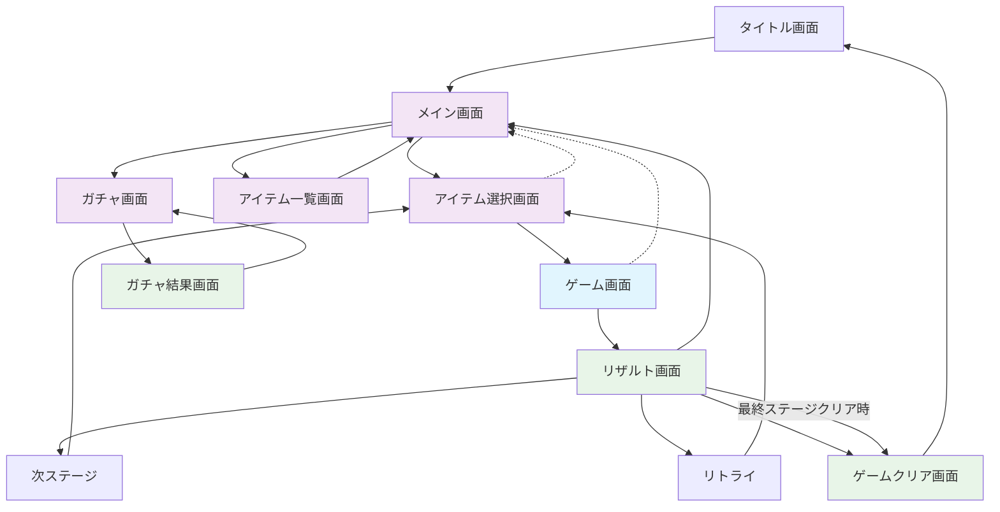

# 画面仕様

## 画面遷移図



## 画面構成

### タイトル画面

#### レイアウト

```
┌──────────┐
│                    │
│   🌊 さめがめ      │
│    オーシャン 🌊   │
│                    │
│                    │
│   [ゲーム開始]     │
│                    │
│                    │
│   Ver 1.0.0        │
└──────────┘
```

#### 要素

* ゲームタイトル: 海をイメージしたロゴ
* ゲーム開始ボタン: タップでメイン画面へ
* バージョン表示: 画面下部に小さく表示
* 背景: 海の波のアニメーション

### メイン画面

#### レイアウト
```
┌──────────┐
│     ゴールド: 1,250│
├──────────┤
│                    │
│     ステージ 15    │
│                    │
│                    │
│      [プレイ]      │
│                    │
├──────────┤
│ [アイテム] [ガチャ]│
└──────────┘
```

#### 要素

* ヘッダー: 所持ゴールド表示
* ステージ情報: 現在のステージ番号と星評価
* プレイボタン: アイテム選択画面へ
* メニューボタン群: アイテム管理、ガチャへの入り口

### アイテム選択画面

#### レイアウト
```
┌───────────┐
│ アイテム選択          │
├───────────┤
│ ◆特殊枠（S・Aレア用）│
│ [爆弾×3]  [未選択]   │
│                      │
│ ◆通常枠（B〜Fレア用）│
│ [未選択]  [チェンジワン×2] │
│                      │
│ ◆所持アイテム一覧    │
│  爆弾×3 (S)         │
│  スコアブースター×1 (A) │
│  ハンマー×1 (C)     │
│  シャッフル×5 (E)   │
│  チェンジワン×2 (D) │
├───────────┤
│  [決定] [キャンセル] │
└───────────┘
```

#### 要素

- **装備枠の視覚的表現**:
  - **特殊枠**: 金色の装飾的な枠、星や光のエフェクトを追加
  - **通常枠**: シンプルな銀色または青色の枠、控えめなデザイン
  - 各枠にレア度の制限を明記（「S・Aレア用」「B〜Fレア用」）

- **アイテム選択時の視覚的フィードバック**:
  - 選択可能なアイテムは明るく表示
  - 選択できないアイテム（例：通常枠にS・Aレアアイテム）は暗く表示
  - 不適合の場合は「このアイテムはこの枠に装備できません」というメッセージを表示

- **アイテム表示**:
  - アイテム名と所持数を表示
  - レア度を括弧内に表示（例：「(S)」「(A)」）
  - レア度に応じた色分け（S：金色、A：赤色など）

- **操作方法**:
  - アイテムをタップして選択
  - 選択したアイテムは対応する枠に表示
  - 「決定」ボタンで確定してゲーム画面へ
  - 「キャンセル」ボタンでメイン画面に戻る

- **チュートリアル要素**:
  - 初回プレイ時に枠の違いを説明するチュートリアル表示
  - 「特殊枠にはS・Aレアアイテムを、通常枠にはB〜Fレアアイテムを装備できます」という説明
  - 「特殊枠には通常アイテムも装備可能です」という補足


### ゲーム画面

#### レイアウト
```
┌───────────┐
│ Stage 15  Score:0    │
│ Target: 500          │
├───────────┤
│                      │
│   ゲ ー ム 盤 面     │
│                      │
│                      │
│                      │
│                      │
│                      │
├───────────┤
│[爆弾] [ハンマー]     │
│            [リタイア]│
└───────────┘
```

#### 要素

- ゲーム情報: ステージ番号、現在スコア、目標スコア
- ゲーム盤面: ブロック配置エリア
- アイテムスロット: 選択したアイテム
- リタイアボタン: メイン画面に戻る

### リザルト画面

#### レイアウト
```
┌───────────┐
│ ステージ 15 クリア！ │
├───────────┤
│ スコア: 700         │
│ 目標:   500 ✓      │
│                     │
│ 獲得ゴールド: 700   │
│                     │
│                     │
│ 使用アイテム:       │
│ • 爆弾 ×1          │
│ • ハンマー ×1      │
├───────────┤
│ [次へ] [メイン画面]  │
└───────────┘
```

#### 要素

- クリア表示: ステージクリア情報
- スコア詳細: 獲得スコアと目標の比較
- 報酬: 獲得ゴールドと星評価（1-3個）
- 使用アイテム: 今回使ったアイテム一覧
- 次のアクション: 次ステージ（ゲームクリアできなかった場合にはリトライ）、メイン画面


### ガチャ画面

#### レイアウト

```
┌───────────┐
│ ガチャ ゴールド:1250 │
├───────────┤
│                      │
│   オーシャンガチャ   │
│        (100G)        │
│                      │
│ [1回引く] [10回引く] │
│                      │
│   排出アイテム:      │
│   • スワップ         │
│   • チェンジワン     │
│   • ミニ爆弾         │
│   • 溶解剤           │
│                      │
├───────────┤
│ [戻る]               │
└───────────┘
```

#### 要素

* ゴールド表示: 現在の所持金
* ガチャ名: 統一されたガチャ名
* 料金: ガチャの価格
* 引くボタン: 1回・10回の選択肢
* 排出アイテム一覧: 現在のステージ進行度で出現するアイテム
* 戻るボタン: メイン画面に戻る


### ガチャ結果画面

#### レイアウト

```
┌───────────┐
│ ガチャ結果           │
├───────────┤
│                      │
│                      │
│                      │
│     爆弾    x 1      │
│                      │
│                      │
│                      │
├───────────┤
│ [もう一度] [戻る]    │
└───────────┘
```

#### 要素

- 結果表示: 獲得アイテムのアニメーション表示
- アイテム名と獲得数: 今回の獲得アイテムと獲得数
- アクションボタン: 連続ガチャ・ガチャ画面に戻る

### ゲームクリア画面

#### レイアウト

```
┌───────────┐
│ ゲームクリア！      │
├───────────┤
│                     │
│  おめでとう！       │
│  全てのステージを    │
│  クリアしました！    │
│                     │
│  総獲得スコア:      │
│  1,234,567          │
│                     │
│  総獲得ゴールド:    │
│  12,345 G           │
├───────────┤
│ [タイトルへ戻る]    │
└───────────┘
```

#### 要素

- クリア表示: ゲームクリアの祝福メッセージ
- 総合成績: 全ステージの総獲得スコアと総獲得ゴールド
- アクションボタン: タイトル画面に戻る

### アイテム一覧画面

#### レイアウト

```
┌───────────┐
│ アイテム一覧         │
├───────────┤
│ 爆弾             ×3 │
│ ハンマー         ×1 │
│ シャッフル       ×5 │
│ チェンジワン     ×2 │
│ スワップ         ×4 │
│ ミニ爆弾         ×8 │
│                      │
│                      │
│ 総アイテム数: 23     │
├───────────┤
│ [戻る]               │
└───────────┘
```

#### 要素

* アイテムリスト: 所持している全アイテムと個数、装備状態
* 総数表示: 所持アイテムの合計数
* 戻るボタン: メイン画面に戻る
